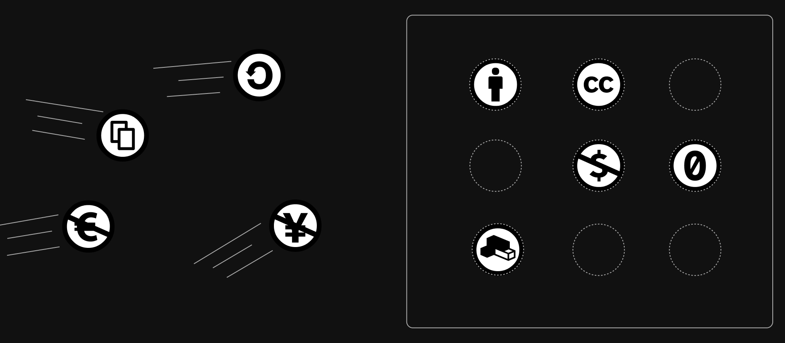

Example code demonstrating the use of icon spritesheets in Vue.

See [ajithranka/icon-spritesheets](https://ajithranka/icon-spritesheets).

## Developement

| Command         | Action                                      |
| :-------------- | :------------------------------------------ |
| `npm install`   | Install dependencies                        |
| `npm run dev`   | Starts local dev server at `localhost:8080` |
| `npm run build` | Build your production site to `./dist/`     |

## How it works

The [`create-icon-spritesheet.js`](./scripts/create-icon-spritesheet.js) script reads all icon SVG files in [`assets/icons`](./src/assets/icons/), converts them to symbols, and generates a spritesheet component at [`components/AppIconSpritesheet.vue`](./src/components/AppIconSpritesheet.vue). Each symbol gets a unique id based on the icon's file name.

The [`AppIcon.vue`](./src/components/AppIcon.vue) component encapsulates icon usage with the `<use>` element and a `name` prop which maps the icon name to symbol id.

Checkout the [article](https://ajithranka/icon-spritesheets) for a details write-up.

## Credits

All icons under the [`assets/icons`](./src/assets/icons) are from [creativecommons.org/about/downloads](https://creativecommons.org/about/downloads/).
